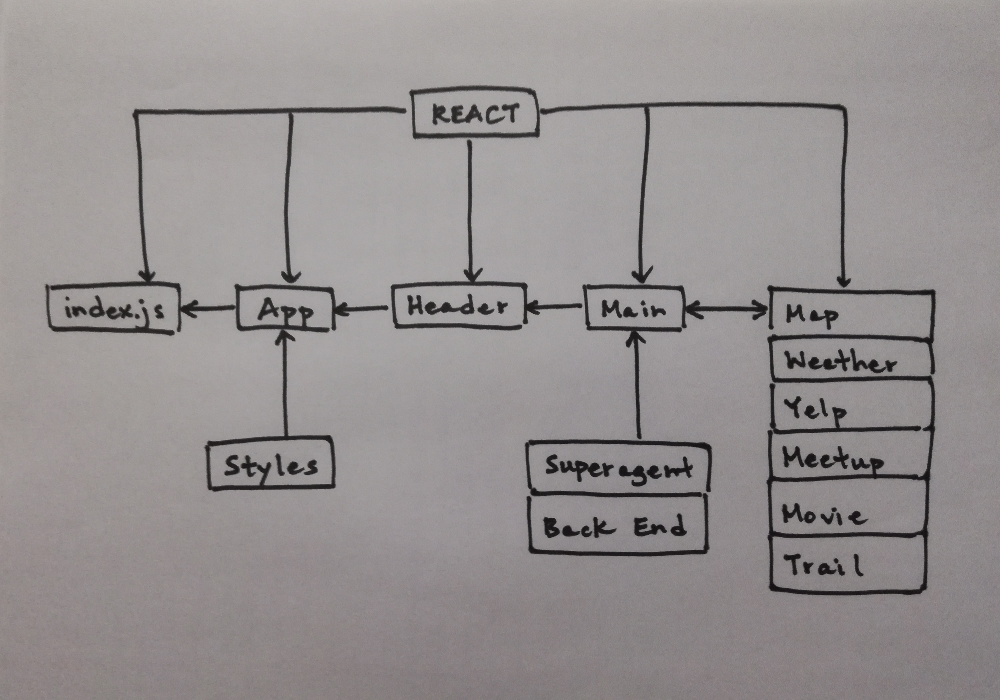

 Week 6 Project
=================================================

## City Explorer

### Author: Katherine Smith

### Links and Resources
* [Repository](https://github.com/ksmith10309/city-explorer)
* [Deployed Site](http://city-explorer.s3-website-us-west-2.amazonaws.com)
* [Create React App](https://github.com/facebook/create-react-app)
* [Deployed Back End](https://city-explorer-backend.herokuapp.com)

### Modules
#### `app.js`
* Renders the Header React component from header.js 
* Renders the Main React component from main.js

#### `header.js`
* Contains and exports the Header React component
* Renders the header

#### `main.js`
* Contains and exports the Main React component
* Renders the form for location input
* Contains the onChange method for the form
* Contains the onSubmit method for the form
* Renders the Map React component from map.js
* Renders the columns for API data
* Renders the Weather React component from weather.js
* Renders the Yelp React component from yelp.js
* Renders the Meetup React component from meetup.js
* Renders the Movie React component from movie.js
* Renders the Trail React component from trail.js

#### `map.js`
* Contains and exports the Map React component
* Renders the map

#### `weather.js`
* Contains and exports the Weather React component
* Renders results from the Dark Sky API

#### `yelp.js`
* Contains and exports the Yelp React component
* Renders results from the Yelp API

#### `meetup.js`
* Contains and exports the Meetup React component
* Renders results from the Meetup API

#### `movie.js`
* Contains and exports the Movie React component
* Renders results from the Movie DB API

#### `trail.js`
* Contains and exports the Trail React component
* Renders results from the Hiking Project API

### Setup
#### Dependencies
* Run the command `npm i` to install dependencies

#### Running the app
* Run the command `npm start` to compile
* Navigate to `http://localhost:3000/` to view in the browser

#### Tests
* Run the command `npm test` to start tests
* Test suite in `app.test.js` will run
* The assertion that it renders without crashing was made

#### UML
